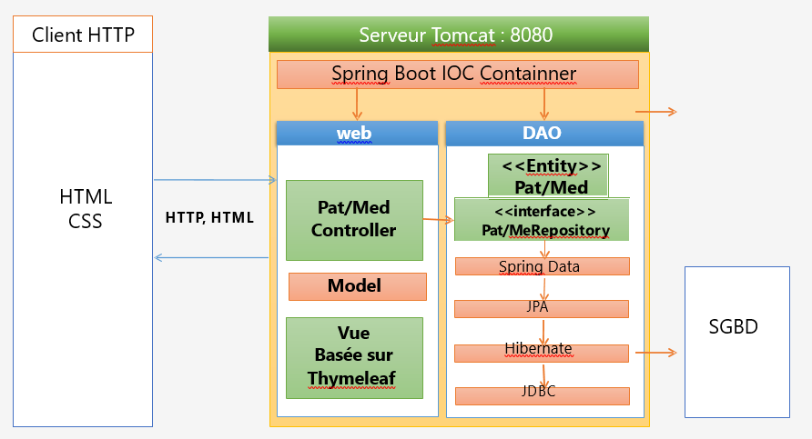
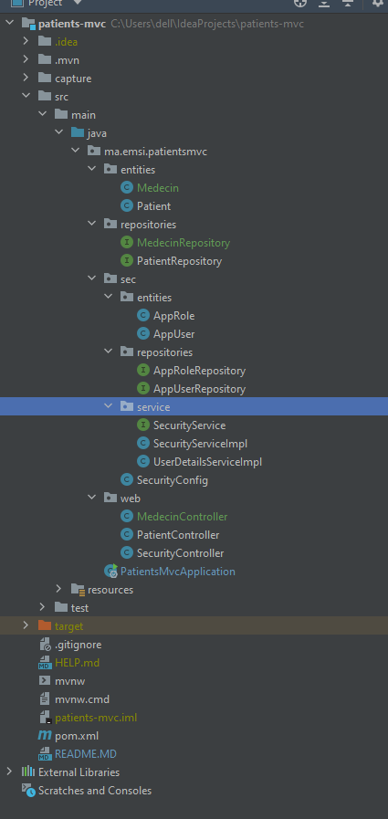
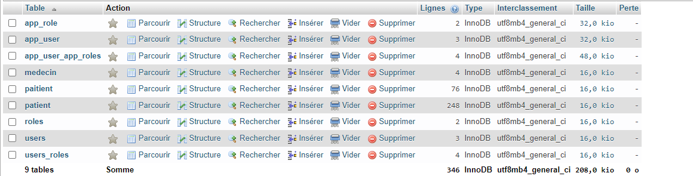
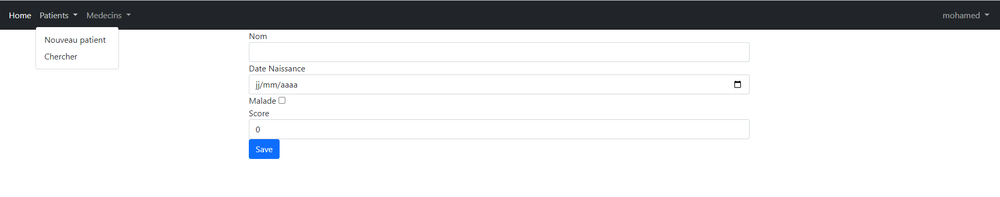
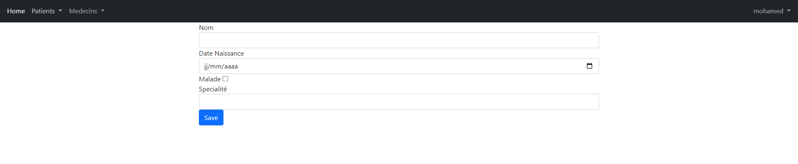
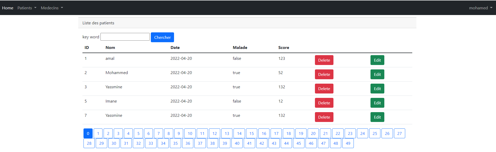
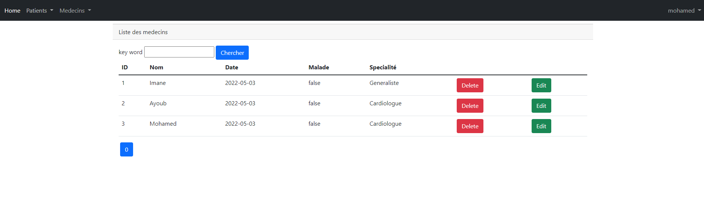

<h2> Compte rendu </h2>

la création d'une application qui permet de gérer des patients. 
Chaque patient est défini par : 
• Son ID de type Long  
• Son Nom de type String 
• Sa Date de naissance 
• Un attribut qui indique si le patient est malade ou non 
• Un score de type int 

L’applications permettra aux : 
<b>utilisateurs de:</b> 
• Consulter les patients 
• Consulter les medecins 
• Chercher les patients par nom 
<b>administrateurs de:</b> 
• Ajouter de nouveaux patients 
• Consulter les patients 
• Chercher les patients par nom 
• Consulter un patient 
• Mettre à jour un patient 
• Supprimer un patient 
•Consulter les medecins 
• Chercher les medecins par nom 
• Consulter un medecins 
• Mettre à jour un medecin 
• Supprimer un medecin 

Les données sont stockées dans une base de données MySQL 
La couche web respecte MVC coté serveur. 

<h3><u>structure du projet</u></h3> 
 

<h3><u>la base de donnee pat_db</u></h3> 

<h3><u>Couche Web</u></h3> 

nouveau patient

nouveau medecin

Consulter les patients

Consulter les medecins

 
Login

Logout

